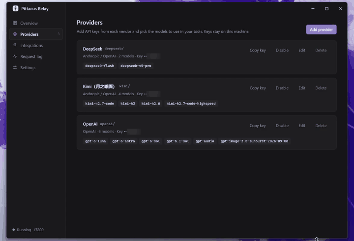

<div align="center">

# Pittacus Relay

**An API-key vault and local model gateway for your AI coding tools.**

[](https://github.com/ctrlcakepro/pittacus-relay/releases/latest)
[](LICENSE)
[](#download-and-install)

English (this page) · [简体中文](README.zh-CN.md)

[API-key vault](#api-key-vault-real-keys-stay-home) · [Download](#download-and-install) · [Supported tools](#supported-tools) · [Security](#security) · [Roadmap](#roadmap)

</div>

---

Your providers' real API keys are locked inside Pittacus Relay. Agent tools such as Claude Code, Codex and opencode only receive a **local key that works on this computer alone and can be replaced at any time**. You can also switch between providers' models from the tool's own `/model` list, with no config editing and no switcher app.

<p align="center">
  
  <br>
  <sub>Connect Claude Code, check that <code>settings.json</code> holds only a local key, then switch models from <code>/model</code>. Key values are blurred.</sub>
</p>

> The name comes from Pittacus of Mytilene, one of the Seven Sages of ancient Greece. The logo is a hydra: the body is the gateway on your machine, and each head is a model provider. The development codename was Hydra.

## API-key vault: real keys stay home

The common approach is to write the provider key straight into the agent tool's config, so it ends up in `~/.claude/settings.json`, in environment variables, and anywhere else the agent can read. Pittacus Relay inverts this: **the vault holds the key, the tool only holds a pass.**

After connecting Claude Code, what Pittacus Relay writes into `~/.claude/settings.json` looks like this:

```jsonc
"env": {
  "ANTHROPIC_BASE_URL": "http://127.0.0.1:17800",
  "ANTHROPIC_AUTH_TOKEN": "pittacus-…"   // a local key, not any provider's key
}
```

The real key is added to the outgoing https request header by the gateway only at the moment it forwards a request. It is not written to any tool config, it never reaches the UI process, and it does not enter the request log. When connecting, Pittacus Relay also removes any existing `ANTHROPIC_API_KEY` from that file's `env` (and puts it back on "Restore").

**If your config leaks, what does the other party get?**

| Scenario | Real key in config | With Pittacus Relay |
|---|---|---|
| You push your dotfiles / `settings.json` to GitHub | The provider key is public and can be abused from anywhere | Only a local key, valid only on the `127.0.0.1` gateway of your machine |
| It shows up in a screenshot, recording, or a config pasted for help | Same | Same. Click "Regenerate" on the Overview page and the old key is invalid immediately; connected tools are synced automatically (manually configured tools need the new key) |
| An agent hit by prompt injection reads env vars or config files | It reads the provider key and can take it elsewhere | It reads only the local key, which is useless off your machine (on your machine it can still call models through the gateway, which is what the agent is normally allowed to do anyway) |
| You need to revoke | Sign in to each provider's console, regenerate, then update everywhere it is used | Regenerate the local key; provider keys are unaffected and need no changes |

This isolation protects the **config-file and agent-environment leak path**, not "everything on the machine". Malicious programs running under the same OS account may still be able to obtain the key; see "Boundaries" in [Security](#security).

## Download and install

**[Download the latest release →](https://github.com/ctrlcakepro/pittacus-relay/releases/latest)** (the release notes include a SHA-256 checksum for every installer)

| System | Installer |
|---|---|
| Windows 10/11 (x64) | `Pittacus-Relay-<version>-win-x64.exe` |
| Windows on ARM | `Pittacus-Relay-<version>-win-arm64.exe` |
| macOS, Apple silicon (M-series) | `Pittacus-Relay-<version>-mac-arm64.dmg` |
| macOS, Intel | `Pittacus-Relay-<version>-mac-x64.dmg` |

macOS also ships a `.zip` for each architecture: unzip it and drag `Pittacus Relay.app` into Applications, same result as the `.dmg`.

The installers are **not code-signed yet**, so the OS will stop you the first time you open one (an application to SignPath Foundation for free open-source Windows signing is pending; see [Code signing policy](#code-signing-policy)):

- **Windows**: when SmartScreen says "Windows protected your PC", click "More info" → "Run anyway".
- **macOS**: when you see "cannot verify the developer" or "is damaged", open System Settings → Privacy & Security and click "Open Anyway" at the bottom, or run `xattr -cr "/Applications/Pittacus Relay.app"` in a terminal and open it again.

After installation Pittacus Relay lives in the system tray (Windows) or menu bar (macOS). Closing the window does not stop the gateway. To quit completely, use "Quit" in the tray menu, or run `"Pittacus Relay.exe" --quit`.

Startup options (Settings → Startup, also toggleable from the tray menu):

- **Launch at login**: starts Pittacus Relay after you sign in. On Windows it writes a per-user startup entry (removed on uninstall, kept on upgrade); on macOS it registers a login item, and the first time you may need to allow it in System Settings → General → Login Items.
- **Start silently**: no main window on launch, tray only; double-click the app icon again or click the tray icon to open it.

The UI supports Simplified Chinese and English (Settings → Language, follows the system by default); the tray menu and system notifications switch with it.

Appearance (Settings → Appearance): theme can follow the system, or be light or dark. The accent color defaults to the brand purple, with nine Apple system colors to choose from (blue, purple, pink, red, orange, yellow, green, teal, graphite), each using its official light/dark value.

At the bottom of the Overview page, **API usage** summarizes requests, input/output tokens and cache hits for today / 7 days / 30 days, broken down by model. Token counts come from the provider response's `usage` field (requests and responses are not modified) and are stored per day and per model in `usage.json` on your machine for 90 days, with no conversation content. Requests whose upstream returns no `usage` are counted as requests only. When connecting opencode, `includeUsage` is turned on so streamed replies carry usage too.

## How it works

```
 Tools hold only the local key            Vault: real keys are stored encrypted here
Claude Code ──(Anthropic format)──┐
Codex ───────(Responses API)──────┼─► Pittacus Relay 127.0.0.1:17800 ──route by model──► DeepSeek / Kimi / GLM / Qwen / …
opencode ────(OpenAI format)──────┘    check local key → swap in that provider's real key → forward over https
```

- The gateway does not forward the tool's request headers as-is: headers sent to the provider are rebuilt by Pittacus Relay, so the local key never leaves your machine; from the provider's response only a few headers (content type, rate limits, etc.) are let through.
- Model names use the form `provider-id/model`, for example `kimi/kimi-k2`; a bare model name is also accepted when it is unambiguous.
- If a tool asks for a model Pittacus Relay does not recognize (such as Claude Code's built-in `claude-haiku-*`), it falls back to the "light model / main model" settings.
- Anthropic and Chat Completions requests are forwarded directly to the provider's own Anthropic or OpenAI-compatible endpoint, with **no Anthropic ↔ OpenAI conversion**.
- The only conversion exists for Codex: Codex speaks only the OpenAI Responses API, while many providers offer only Chat Completions. For such upstreams the gateway converts `/v1/responses` requests to `/chat/completions` and converts the streamed reply (text, tool calls, reasoning) back into Responses events. If you tick Responses API in a provider's Advanced settings (ticked by default for the OpenAI preset), requests are forwarded unchanged. The conversion does not support OpenAI-hosted tools such as web search or image generation.
- No subscription-account (OAuth) forwarding: only regular API keys are aggregated.

## Supported tools

| Tool | Config Pittacus Relay writes | How you switch |
|---|---|---|
| Claude Code (v2.1.242+) | `env` and `modelPicker` in `~/.claude/settings.json` | `/model` |
| Codex | `model_provider`, `model`, `model_catalog_json` and `[model_providers.pittacus]` in `~/.codex/config.toml`; the model catalog goes to `~/.codex/pittacus-models.json` | `/model` |
| opencode | `provider.pittacus` in `~/.config/opencode/opencode.json` | `pittacus/…` in the model list |

Original values are recorded before anything is written; "Restore" undoes only the fields Pittacus Relay wrote. Adding or removing models, changing the port or regenerating the key syncs automatically to connected tools.

About Codex:

- Only models with an OpenAI-compatible endpoint are listed; providers that only have an Anthropic endpoint (such as Anthropic itself) cannot be used with Codex for now.
- `config.toml` is edited line by line, so comments, order and other settings (MCP servers, etc.) stay as they are. If the file already defines a `pittacus` provider in another form (inline table, dotted keys), Pittacus Relay will not overwrite it and will ask you to handle it manually.
- The model catalog **replaces** Codex's built-in model list (consistent with Claude Code's `replaceBuiltInOptions`). Catalog entries use models from the local Codex cache (`~/.codex/models_cache.json`) as templates where possible, keeping their full agent instructions; the context window is conservatively set to 128K.
- Converted models offer no reasoning-effort option (Chat Completions has no uniform equivalent parameter); native Responses upstreams offer low / medium / high.
- If `CODEX_HOME` is set, files are written there. A running Codex must be restarted to pick up the new config.

## Security

For the vault design see [API-key vault](#api-key-vault-real-keys-stay-home) above; these are the concrete protections.

- **Local only**: the gateway listens on `127.0.0.1` only, and every request must carry the local key; the request Host must be a loopback address and cross-site requests from web pages are rejected (against DNS rebinding).
- **Encrypted storage**: provider keys are encrypted with the OS key store (Electron `safeStorage`: DPAPI on Windows, Keychain on macOS) before being saved, and the UI process never sees the plaintext.
- **Key bound to address**: when you change a provider's address (including a different path on the same domain) you must re-enter the key; a saved key is never carried over to a new address.
- **No plaintext, no redirects**: upstreams must be https (except local addresses such as Ollama); if an upstream returns a redirect, Pittacus Relay reports an error instead of following it with the key.
- **File permissions**: config files written by Pittacus Relay are readable only by the current user on macOS (0600).
- **App hardening**: windows cannot navigate to any external page, IPC only answers Pittacus Relay's own UI; the installer disables Electron's RunAsNode, `NODE_OPTIONS`, `--inspect` and other entry points other programs could borrow, refuses to start with remote-debugging arguments, and verifies asar integrity.
- **Copying a key requires verification**: on the Providers page you can copy a provider's real key, but you must first set a PIN under Settings → Key protection, and every copy requires the PIN, or Windows Hello / Touch ID once enabled. Setting the PIN for the first time also requires confirming it is you via Windows Hello / Touch ID, so nobody else can set the PIN first and copy your keys; where the device has no such system verification this cannot be confirmed and the UI tells you to set it up yourself early. Verification happens in the main process and the UI process never sees plaintext; after 5 wrong attempts the app locks out starting at 30 seconds, doubling each time (up to 15 minutes), and a restart does not reset it. The copied value is cleared from the clipboard after 30 seconds and flagged to stay out of Windows clipboard history and cloud clipboard (marked as hidden content on macOS for clipboard managers to recognize). A forgotten PIN can only be reset, and a reset also clears all saved keys.
- **No peeking at conversations**: the request log and usage statistics record only summaries and token counts, never conversation content, and there is no telemetry.

**Boundaries** (stated honestly): the OS key store protects against a copied config file being decrypted and against other OS accounts reading it; it does not defend against a malicious program already running under your account, which can read the local key just as the agent tool does. The PIN and Windows Hello / Touch ID are only an identity check before copying: they protect against someone copying your key from an unlocked computer while you are away, not an extra layer of encryption; once a key is in the clipboard, other programs in the same account can read it until it is cleared. When connecting Claude Code, any key in the original `settings.json` is moved into the restore record and encrypted with the same OS key store, so it does not stay in plaintext under `~/.claude/`. Also, the installers are not code-signed yet, see the roadmap.

## Code signing policy

Free code signing provided by [SignPath.io](https://about.signpath.io/), certificate by [SignPath Foundation](https://signpath.org/). (The Windows application is pending; installers released before approval remain unsigned.)

- Scope: only the Windows program `Pittacus Relay.exe` and the installer `Pittacus-Relay-<version>-win-*.exe`, built from this repository's source by GitHub Actions, are signed; bundled upstream components (the Electron runtime, etc.) are not signed with this project's certificate. The signing configuration is in [`.signpath/`](.signpath/).
- Every release requires manual approval before it is signed.
- Committers and reviewers: [ctrlcakepro](https://github.com/ctrlcakepro)
- Approvers: [ctrlcakepro](https://github.com/ctrlcakepro)

**Privacy policy**: This program will not transfer any information to other networked systems unless specifically requested by the user or the person installing or operating it. That is: Pittacus Relay has no telemetry and only forwards requests to the model providers you configured yourself; how those providers handle your data is governed by their own privacy policies.

## Development

```bash
npm install
npm run dev        # start in development mode
npm test           # unit tests for the gateway and config writers
npm run typecheck
npm run build
npm run dist:win   # Windows installer → dist/
npm run dist:mac   # macOS installer (macOS only)
npm run install:win  # package + silently install over the local copy and launch (use it to update your local install after code changes)
```

After pushing to GitHub, `.github/workflows/build.yml` builds on Windows and macOS machines separately; pushing a `v*` tag automatically creates a draft Release containing all installers.

Changing the icon: the logo is vector-drawn. Geometry and animation parameters are in `src/renderer/src/brand/geometry.ts` and animation styles in `hydra-mark.css` (the mark is a hydra, and the file names keep "hydra"). After editing, run `npm run brand` (needs Python + Pillow; set the `PYTHON` environment variable to choose the interpreter). It generates `build/icon.png` (macOS), `build/icon.ico` (Windows), the window and tray icons under `resources/`, the full set of black-and-white SVG / PNG / ICO under `design/brand/`, and the animation showcase page `showcase.html`. The old purple icon and its generator are backed up in `design/brand/reference/violet/`.

`PITTACUS_RELAY_DATA_DIR`, `CLAUDE_CONFIG_DIR`, `CODEX_HOME` and `XDG_CONFIG_HOME` can point app data and write targets at a temporary directory, so you can test without touching your real config.

Layout:

```
src/core/      gateway, routing, config store, tool integrations (no Electron dependency, easing a port to HarmonyOS Electron)
src/main/      Electron main process: windows, tray, IPC
src/preload/   secure bridge (contextIsolation + sandbox)
src/renderer/  React UI
src/shared/    type contracts between the main process and the UI
```

## Roadmap

- [x] Windows / macOS installers (electron-builder + GitHub Actions)
- [ ] Windows code signing (SignPath Foundation; CI is wired up, awaiting project approval)
- [ ] macOS signing and notarization (needs an Apple Developer ID), removing the first-open system block
- [ ] Auto-update
- [ ] OpenAI ↔ Anthropic protocol conversion (so models with only an OpenAI endpoint can be used with Claude Code)
- [x] Codex integration (OpenAI Responses API, converted to Chat Completions when needed)
- Idea: HarmonyOS PC edition (not scheduled; first needs on-device verification that the sandbox can write tool configs and that terminals can reach local ports)

## License

[MIT](LICENSE)
